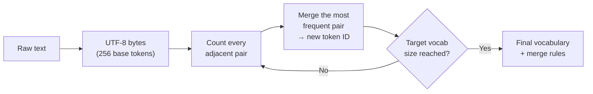

<div align="center">

# 🔤 BPE Tokenizer, From First Principles

### Building the algorithm behind GPT-2, GPT-4, and LLaMA — byte by byte, merge by merge.

<p>
  
  
  
  
  
</p>

<p><i>No pretrained tokenizer used as a crutch. Every piece — counting, merging, encoding, decoding — built and understood line by line.</i></p>

</div>

<br>

## 📖 Table of Contents

- [Why This Exists](#-why-this-exists)
- [How BPE Works](#-how-bpe-works)
- [What's Inside](#-whats-inside)
- [Sample Results](#-sample-results)
- [Quickstart](#-quickstart)
- [Tokenizer Showdown](#-tokenizer-showdown)
- [Repository Structure](#️-repository-structure)
- [Roadmap](#️-roadmap)
- [References](#-references)

<br>

## 💡 Why This Exists

Tokenization is the unglamorous foundation that quietly explains most of an LLM's weirdest behavior:

<div align="center">

| Symptom | Root Cause |
|:---|:---|
| ❌ Can't spell words reliably | Tokenization |
| ❌ Fails at reversing a string | Tokenization |
| ❌ Worse at Japanese than English | Tokenization |
| ❌ Bad at simple arithmetic | Tokenization |
| ❌ Chokes on `SolidGoldMagikarp` | Tokenization |
| ❌ Breaks on `<|endoftext|>` | Tokenization |

</div>

Everything a language model "sees" is downstream of how its tokenizer chopped up the text first. Understand tokenization, and half of the model's strangeness stops being mysterious.

<br>

## ⚙️ How BPE Works



Common substrings — `" the"`, `"ing"`, `"tion"` — collapse into single tokens over successive merges, compressing the sequence while *learning* the vocabulary directly from data.

<br>

## ✨ What's Inside

<table>
<tr><td width="40%"><b>🧱 Raw byte tokenization</b></td><td>UTF-8 text → a base vocabulary of 256 byte tokens</td></tr>
<tr><td><b>🔢 Pair frequency counting</b></td><td>Finding the most frequent adjacent token pair in a sequence</td></tr>
<tr><td><b>🔁 Iterative merging</b></td><td>Growing a custom vocabulary, one merge at a time</td></tr>
<tr><td><b>↔️ <code>encode()</code> / <code>decode()</code></b></td><td>Full round-trip text ↔ token conversion, correctness-verified</td></tr>
<tr><td><b>✂️ GPT-2 regex pre-splitter</b></td><td>Forcing sensible split boundaries before BPE ever runs</td></tr>
<tr><td><b>⚡ <code>tiktoken</code> benchmarking</b></td><td>Comparing against OpenAI's production tokenizer (GPT-2 & <code>cl100k_base</code>)</td></tr>
<tr><td><b>🦙 SentencePiece training</b></td><td>Training BPE the LLaMA-2 way — byte-fallback + identity normalization</td></tr>
<tr><td><b>🌍 Unicode deep dive</b></td><td>A real multi-script corpus — emoji, CJK, Hebrew, Arabic, Devanagari, Zalgo text</td></tr>
</table>

<br>

## 📊 Sample Results

```text
Input corpus         23,328 characters
Raw UTF-8 bytes       24,597 tokens
─────────────────────────────────────────────
After 20 BPE merges (vocab_size = 276)
Encoded length        19,438 tokens
Compression ratio      1.27×
```

```python
>>> decode(encode(text)) == text
True   # perfect round-trip, every time
```

<br>

## 🚀 Quickstart

```bash
# 1. Clone
git clone https://github.com/<your-username>/<your-repo>.git
cd <your-repo>

# 2. Install dependencies
pip install -r requirements.txt

# 3. Launch
jupyter notebook Tokenization.ipynb
```

> Runs top to bottom with zero external datasets — the notebook ships with an embedded Unicode-rich sample text for representative token statistics.

<br>

## 🥊 Tokenizer Showdown

<div align="center">

| | **This Project** | **tiktoken** | **SentencePiece** |
|:---|:---:|:---:|:---:|
| Operates on | Raw bytes | Raw bytes | Unicode code points |
| Training | ✅ From scratch | ❌ Pretrained only | ✅ Configurable |
| Speed | Educational | 🚀 Production-fast | 🚀 Production-fast |
| Used by | — | GPT-2 / GPT-4 | LLaMA / Mistral |
| Rare-char handling | N/A | N/A | Byte-fallback |

</div>

<details>
<summary><b>🔍 Click for a deeper dive into key concepts covered</b></summary>
<br>

- **UTF-8 vs UTF-16 vs UTF-32** encoding trade-offs
- **BPE** as a compression *and* vocabulary-learning algorithm
- **Regex-forced splits** to stop merges bleeding across letters, digits, and punctuation
- Why **GPT-4's tokenizer merges leading spaces** and GPT-2's doesn't
- **SentencePiece's** `character_coverage` and `byte_fallback` hyperparameters
- Special tokens (`<|endoftext|>`) and vocabulary files (`encoder.json`, `vocab.bpe`)

</details>

<br>

## 🗂️ Repository Structure

```
.
├── Tokenization.ipynb   # Main notebook — full BPE implementation & experiments
├── requirements.txt     # Python dependencies
└── README.md            # You are here
```

<br>

## 🛣️ Roadmap

- [ ] Match `minbpe`'s efficiency with a heap-based merge implementation
- [ ] Add special-token handling (`<|endoftext|>`-style) to `encode()` / `decode()`
- [ ] Train a full-scale vocabulary (32K+) on a larger corpus
- [ ] Package as an installable CLI tokenizer

<br>

## 🎓 References

This project follows the spirit of Andrej Karpathy's [**"Let's build the GPT Tokenizer"**](https://github.com/karpathy/minbpe) and the `minbpe` reference implementation.

- [A Programmer's Introduction to Unicode](https://www.reedbeta.com/blog/programmers-intro-to-unicode/) — Nathan Reed
- [tiktoken](https://github.com/openai/tiktoken) — OpenAI
- [SentencePiece](https://github.com/google/sentencepiece) — Google
- [minbpe](https://github.com/karpathy/minbpe) — Andrej Karpathy

<br>

---

<div align="center">

**MIT Licensed** — see [LICENSE](LICENSE) for details

<i>"Tokenization is at the heart of much weirdness of LLMs. Do not brush it off." 🔤</i>

⭐ If this helped you understand BPE, consider starring the repo

</div>
